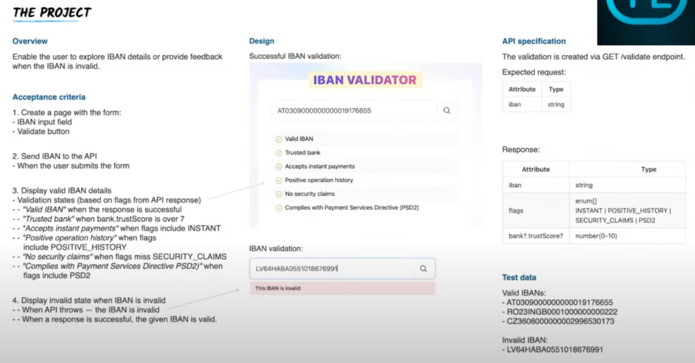

# Ressources 

This project is based on the work of Nik Sumeiko. 

https://github.com/niksumeiko/iban-validator-react-tdd-kata/tree/main
https://www.youtube.com/watch?v=bA7YMGRwfFM

# Project Overview 


»
# Install Vite + Typescript + React 
https://vitejs.dev/guide/

# Install Tailwind CSS
https://tailwindcss.com/docs/guides/vite

# Install vitest 
https://vitest.dev/guide/

why vitest ? https://vitest.dev/guide/why.html
why vitest is complementary of Cypress ? https://vitest.dev/guide/comparisons.html

# Install Cypress
https://docs.cypress.io/guides/getting-started/installing-cypress

# Lint + Prettier 
To ensure that the coding style is consistent in the project from different members, for React + Typescript projects, it is recommended to set up ESLint and Prettier.

## Step 1: Install Dependencies
```bash
yarn add eslint @typescript-eslint/parser @typescript-eslint/eslint-plugin eslint-plugin-react -D
```

## Step 2: Create ESLint Config File
Create a .eslintrc.js file at the root path and set up the ESlint config:

```javascript
module.exports = {
    root: true,
    env: { browser: true, es2020: true },
    extends: [
        'eslint:recommended',
        'plugin:@typescript-eslint/recommended',
        'plugin:react-hooks/recommended',
    ],
    ignorePatterns: ['dist', '.eslintrc.cjs'],
    parser: '@typescript-eslint/parser',
    plugins: ['react-refresh'],
    rules: {
        'react-refresh/only-export-components': [
            'warn',
            { allowConstantExport: true },
        ],
    },
}
```

## Step 3: Install Prettier Dependencies

```bash
yarn add prettier eslint-config-prettier eslint-plugin-prettier -D
```

## Step 4: Create Prettier Config File
Create a .prettierrc.js file at the root path and set up the Prettier config:

```json
{
    "printWidth": 90,
        "trailingComma": "all",
        "tabWidth": 4,
        "semi": true,
        "singleQuote": true,
        "overrides": [
        {
            "files": "*.json",
            "options": {
                "tabWidth": 2
            }
        }
    ]
}

```

## Step 5: Update ESLint Config to Integrate Prettier
Update .eslintrc.js:

```javascript
module.exports = {
  parser: '@typescript-eslint/parser',
  extends: [
    'plugin:react/recommended',
    'plugin:@typescript-eslint/parser',
    'prettier/@typescript-eslint', // add this line
    'plugin:prettier/recommended', // add this line
  ],
  parserOptions:{
    ecmaVersion: 2018,
    ecmaFeatures: {
      jsx: true,
    },
    settings: {
      react: {
        version: 'detect'
      }
    }
  }
}
```

## Step 6: Configure Editor on save
Ensure your editor is configured to format on save. 


# High-level test coverage critical user journey (CUJ)

firstable we need to define the critical user journey (CUJ) of our application.

```text
Feature: Validate International Bank Account Number (IBAN)

I want to know the IBAN details

Scenario: Validate IBAN
Given I open a validation page
When I provide an IBAN
Then I see validation details

```

